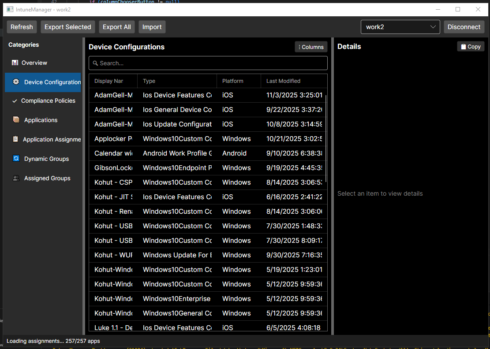
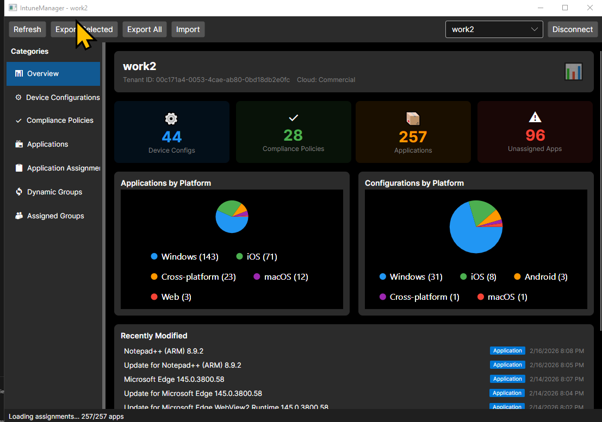

# Intune Commander - .NET Remake

A cross-platform Intune management tool built with .NET 8 and Avalonia UI, designed to overcome PowerShell WPF limitations in threading, UI refresh, and data caching.

## Project Overview

### Origin
This project is a ground-up remake of [Micke-K/IntuneManagement](https://github.com/Micke-K/IntuneManagement), a PowerShell/WPF-based Intune management tool.

### Screenshots 





### Goals
- **Multi-cloud support:** Commercial, GCC, GCC-High, DoD tenants
- **Multi-tenant:** Easy switching between tenant environments with profile management
- **Native performance:** Compiled .NET code eliminates PowerShell threading issues
- **Cross-platform:** Linux and macOS support via Avalonia
- **Backward compatible:** Import/export compatible with PowerShell version JSON format

### Non-Goals (Removed from original)
- ADMX import tooling
- Exact feature parity with PowerShell version

## Technology Stack

### Core Technologies
- **.NET 8** - Latest LTS framework
- **C# 12** - Primary language with nullable reference types
- **Avalonia 11.3** - Cross-platform XAML UI framework (FluentTheme)
- **Azure.Identity 1.17** - Modern authentication (Interactive Browser + Client Secret)
- **Microsoft.Graph 5.x** - Official Graph SDK with native multi-cloud support

### Key Libraries
- **CommunityToolkit.Mvvm 8.2** - MVVM source generators (`[ObservableProperty]`, `[RelayCommand]`)
- **Microsoft.AspNetCore.DataProtection 8.0** - Cross-platform encryption for profile storage
- **MessageBox.Avalonia 3.2** - Confirmation dialogs
- **Avalonia.Controls.DataGrid 11.3** - Data grid UI component
- **xUnit 2.5** - Unit testing framework

### Deployment Targets
- **Phase 1-5:** Windows desktop application
- **Phase 6+:** Docker containerization for headless operations

## Architecture

### MVVM Pattern
- **ViewModelBase** with `IsBusy`/`ErrorMessage` base properties
- **CommunityToolkit.Mvvm** source generators for property/command boilerplate
- **Interface-based services** with dependency injection
- **Async-first** — UI startup never blocks; all data loading happens after window is visible

### Authentication
- **Interactive Browser Login:** Default authentication method for interactive sessions
- **Client Secret Authentication:** App-only authentication for automated scenarios
- **Multi-cloud support:** Cloud environment selection (Commercial, GCC, GCC-High, DoD)
- **Profile-based:** Named configurations stored locally with DataProtection API encryption

### Service-per-Type Pattern
Each Intune object type has its own service following `I{Type}Service` / `{Type}Service`:
- **ConfigurationProfileService** — Device Configuration CRUD + assignments
- **CompliancePolicyService** — Compliance Policy CRUD + assignments
- **ApplicationService** — Application listing + assignments (read-only)

### Export/Import Strategy
- **Subfolder-per-type:** `DeviceConfigurations/`, `CompliancePolicies/`, `Applications/`
- **Migration table:** Preserves ID mapping for cross-tenant imports
- **Assignments included:** Compliance policies and apps export with their assignment targets
- **Backward compatible:** Reads PowerShell version JSON exports

## Project Structure

```
IntuneManager/
├── docs/                              # Planning and architecture docs
│   ├── PLANNING.md                    # Detailed project plan
│   ├── ARCHITECTURE.md                # Technical architecture
│   ├── DECISIONS.md                   # Key decision log
│   └── NEXT-STEPS.md                  # Implementation roadmap
├── src/
│   ├── IntuneManager.Core/            # Shared business logic
│   │   ├── Auth/                      # Authentication providers
│   │   │   ├── IAuthenticationProvider.cs
│   │   │   ├── InteractiveBrowserAuthProvider.cs
│   │   │   └── GraphClientFactory.cs
│   │   ├── Services/                  # Graph API services
│   │   │   ├── ConfigurationProfileService.cs  # Device Configuration CRUD
│   │   │   ├── CompliancePolicyService.cs      # Compliance Policy CRUD
│   │   │   ├── ApplicationService.cs           # App listing (read-only)
│   │   │   ├── ExportService.cs                # JSON export (all types)
│   │   │   ├── ImportService.cs                # JSON import with creation
│   │   │   ├── ProfileService.cs               # Tenant profile management
│   │   │   └── ProfileEncryptionService.cs     # DataProtection encryption
│   │   ├── Models/                    # Data models
│   │   │   ├── CloudEnvironment.cs    # Commercial/GCC/GCCHigh/DoD enum
│   │   │   ├── TenantProfile.cs       # Tenant connection profile
│   │   │   ├── MigrationTable.cs      # Cross-tenant ID mapping
│   │   │   ├── CompliancePolicyExport.cs  # Policy + assignments wrapper
│   │   │   ├── ApplicationExport.cs       # App + assignments wrapper
│   │   │   └── CloudEndpoints.cs
│   │   └── Extensions/
│   │       └── ServiceCollectionExtensions.cs   # DI registration
│   ├── IntuneManager.Desktop/         # Avalonia UI application
│   │   ├── Views/
│   │   │   ├── LoginView.axaml        # Cloud selection, tenant/client ID, validation
│   │   │   ├── MainWindow.axaml       # Left nav, dynamic DataGrid, detail pane
│   │   │   └── MainWindow.axaml.cs    # Column builder, chooser popup, import picker
│   │   ├── ViewModels/
│   │   │   ├── ViewModelBase.cs       # Base with IsBusy/ErrorMessage
│   │   │   ├── LoginViewModel.cs      # Auth, profiles, GUID validation
│   │   │   ├── MainWindowViewModel.cs # Navigation, data loading, export/import
│   │   │   ├── NavCategory.cs         # Left nav item model
│   │   │   ├── AssignmentDisplayItem.cs   # Assignment display model
│   │   │   └── DataGridColumnConfig.cs    # Configurable column model
│   │   ├── Converters/
│   │   │   └── ComputedColumnConverters.cs  # OData type + platform converters
│   │   └── App.axaml.cs               # Application entry point with DI
└── tests/
    └── IntuneManager.Core.Tests/      # Unit tests (53 tests)
        ├── Models/                    # CloudEndpoints, MigrationTable tests
        └── Services/                  # Export, Profile, Encryption, Validation tests
```

## Current Status

**Stage:** Phase 3 — Expanding Object Types  
**Tests:** 53 passing | **Build:** Zero warnings

### Implemented Features

#### Phase 1 — Foundation ✅
- Multi-cloud authentication (Interactive Browser + Client Secret)
- Device Configuration CRUD via Graph API
- Export/Import services with JSON serialization
- Basic Avalonia UI with login and main window
- Dependency injection setup
- Unit test coverage

#### Phase 2 — Multi-Cloud & Profiles ✅
- Cloud Environment dropdown (Commercial, GCC, GCC-High, DoD)
- GUID validation on Tenant ID and Client ID with inline error messages
- DataProtection API encryption for profile storage
- Profile switcher with confirmation dialog
- Active profile pre-selection on startup
- New Profile / Save / Delete lifecycle

#### Phase 3 — Expanding Object Types (In Progress)
- ✅ Compliance Policies — full CRUD + assignment export/import
- ✅ Applications — list all types, export with assignments (read-only)
- ✅ Left navigation panel with category switching
- ✅ Intune-style detail panes (Properties → Assignments → Type-specific)
- ✅ Async assignment loading with group name resolution
- ✅ Configurable DataGrid columns with chooser UI
- ✅ Computed columns: App Type (from OData type) and Platform (inferred)
- ⏳ Configuration Policies (Settings Catalog)
- ⏳ Conditional Access Policies (read-only)

### Planned
- Advanced import features (dependency resolution, conflict handling)
- Certificate authentication
- Managed Identity support
- Bulk operations
- CLI interface
- Docker containerization

## Quick Links

- [Detailed Project Plan](docs/PLANNING.md)
- [Technical Architecture](docs/ARCHITECTURE.md)
- [Decision Log](docs/DECISIONS.md)
- [Next Steps](docs/NEXT-STEPS.md)
- [AI Assistant Guidance](CLAUDE.md)

## Getting Started

### Prerequisites
- .NET 8 SDK
- Visual Studio 2022, JetBrains Rider, or VS Code with C# Dev Kit
- Azure AD app registration with appropriate Microsoft Graph permissions

### Building the Project

```bash
# Clone the repository
git clone https://github.com/adamgell/IntuneGUI.git
cd IntuneGUI

# Restore dependencies
dotnet restore

# Build the solution
dotnet build

# Run the desktop application
dotnet run --project src/IntuneManager.Desktop

# Run tests
dotnet test
```

### Authentication Setup

For interactive browser authentication:
1. Create an Azure AD app registration
2. Configure redirect URIs for public client flows
3. Grant required Microsoft Graph API permissions (DeviceManagementConfiguration.ReadWrite.All, etc.)
4. Note your Tenant ID and Client ID

For client secret authentication:
1. Follow the same steps as above
2. Create a client secret in your Azure AD app registration
3. Grant admin consent for application permissions

## Contributing

Contributions are welcome! Please ensure:
- All code follows the established architecture patterns
- UI operations remain async and non-blocking
- Unit tests are included for new functionality
- Backward compatibility with PowerShell JSON format is maintained

## License

TBD

## Acknowledgments

Based on [Micke-K/IntuneManagement](https://github.com/Micke-K/IntuneManagement) - PowerShell/WPF implementation
